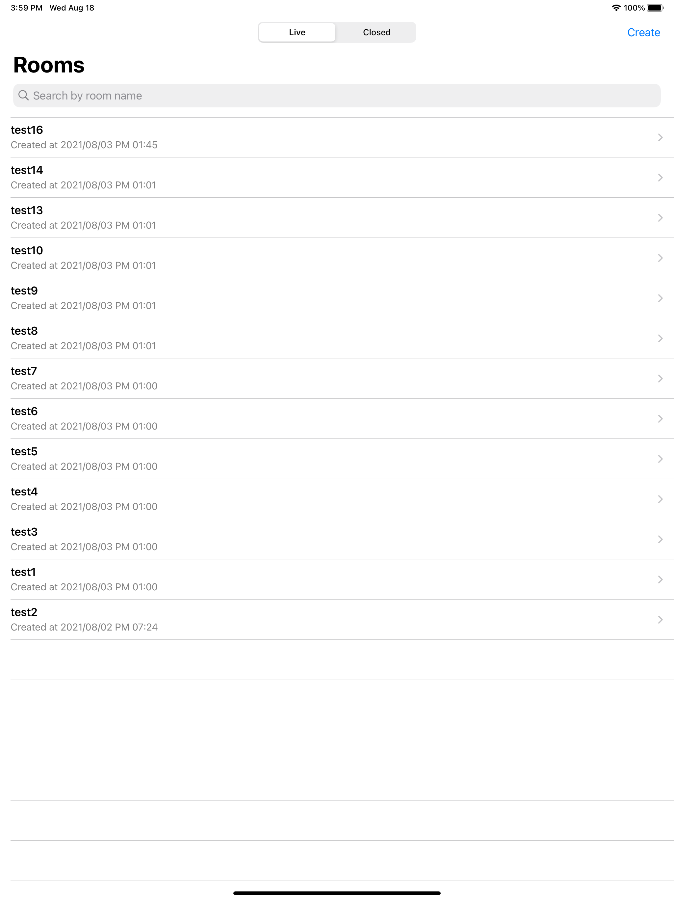
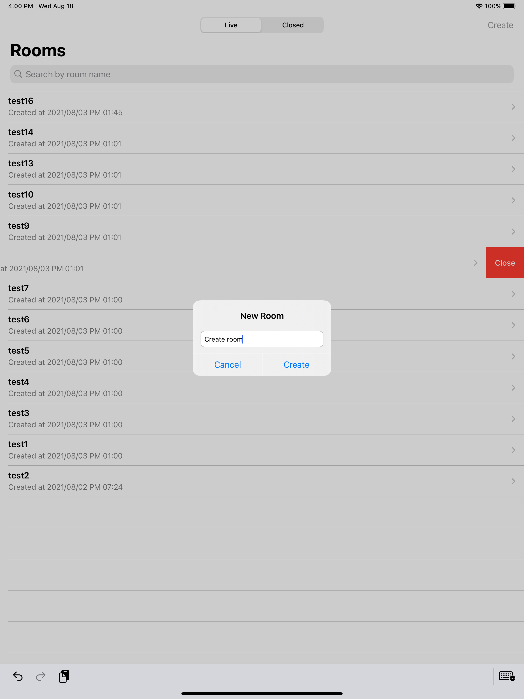

# Pagecall 데모 애플리케이션

본 데모 애플리케이션은 고객사의 원활한 Pagecall 체험 및 도입을 돕기 위해 만들어졌습니다.

## 개요

- 강의실을 생성, 삭제, 입장 할 수 있는 교육용 데모 애플리케이션입니다.
- 이 데모 애플리케이션의 구조를 파악하고 나서, 로그인, 유저-강의실 배정 등의 기능만 추가하면 간단한 교육용 화상강의 서비스를 런칭할 수 있습니다.
 
## 구성

- [웹 데모](./web) : React.js 웹 클라이언트
- [iOS 데모](./ios) : Pagecall iOS SDK를 활용한 iOS 클라이언트
- [Node.js 서버 데모](./server) : Pagecall 서버와 통신하는 API 서버

## 사용 순서
1. [Node.js 서버 데모](./server) 안내를 따라 API 서버를 실행합니다.
2. [iOS 데모](./ios) 안내를 따라 iOS 클라이언트를 실행하고 서버를 연동합니다.
3. 또는 [웹 데모](./web) 안내를 따라 웹 클라이언트를 실행하고 서버를 연동합니다.

## 안내

- [Pagecall 소개 및 도입 문의](https://pagecall.net/)
- [Pagecall 개발자 콘솔](https://console.pagecall.net/)
- [Pagecall API 문서](https://docs.pagecall.net/)
- [Pagecall iOS SDK 도입](https://github.com/pplink/pagecall-ios-example)

## 라이선스
[MIT](./LICENSE)
